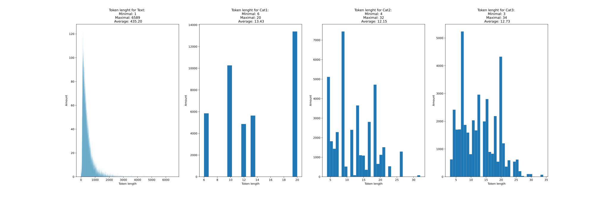
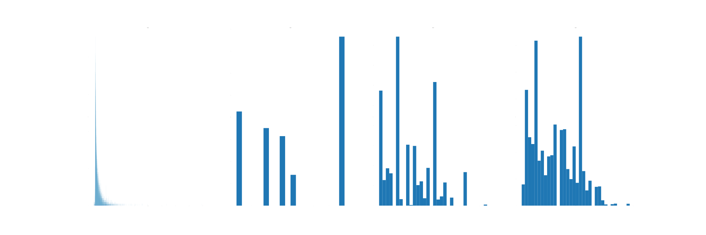

# BERT for hierarchicla text classification on a dataset with Amazon product reviews
Using the pretrained bert-base-uncased form [Hugging Face](https://huggingface.co/bert-base-uncased)   

Dataset with Amazon product reviews, classes are structured as:
* 6 "level 1" classes
* 64 "level 2" classes
* 510 "level 3" classes

The training set contains 40k documents and the test set 10k.  
Each document contains: Title, Text, Cat1, Cat2, Cat3  
## Model architectures

### All at once

### Hierarchical

## Results hyperparameter search:
Results are on the Test set
### Ordered after best f1 score and accuracy
|    | model              |   token |   epochs |     f1 |    acc |   f1 per second |   time per epoch (m) |
|---:|:-------------------|--------:|---------:|-------:|-------:|----------------:|---------------------:|
|  4 | bert-large-uncased |     200 |       10 | 0.8283 | 0.8364 |          0.0678 |                20.35 |
|  6 | bert-large-uncased |     100 |       10 | 0.8277 | 0.8359 |          0.1273 |                10.83 |
|  0 | bert-large-uncased |     100 |       20 | 0.8248 | 0.8339 |          0.1201 |                11.45 |
|  3 | bert-large-uncased |     300 |       10 | 0.823  | 0.8325 |          0.0353 |                38.9  |
|  5 | bert-large-uncased |     300 |       05 | 0.823  | 0.8311 |          0.0398 |                34.47 |
| 13 | bert-base-uncased  |     300 |       05 | 0.8148 | 0.8238 |          0.1347 |                10.08 |
|  1 | bert-large-uncased |     050 |       10 | 0.8145 | 0.8248 |          0.2545 |                 5.33 |
| 10 | bert-base-uncased  |     100 |       20 | 0.8133 | 0.8229 |          0.4303 |                 3.15 |
| 12 | bert-base-uncased  |     100 |       05 | 0.8111 | 0.8223 |          0.5069 |                 2.67 |
| 11 | bert-base-uncased  |     512 |       05 | 0.8089 | 0.8183 |          0.0804 |                16.77 |
|  2 | bert-large-uncased |     512 |       05 | 0.8088 | 0.82   |          0.0218 |                61.82 |
|  9 | bert-base-cased    |     100 |       10 | 0.808  | 0.8179 |          0.4565 |                 2.95 |
|  7 | bert-base-uncased  |     300 |       20 | 0.8077 | 0.8173 |          0.2776 |                 4.85 |
|  8 | bert-base-uncased  |     512 |       20 | 0.8053 | 0.8155 |          0.1462 |                 9.18 |

### Ordered after best f1 per second ratio, i.e. $\frac{f1 \times 100}{\text{time per epoch} (s)}$
|    | model              |   token |   epochs |     f1 |    acc |   f1 per second |   time per epoch (m) |
|---:|:-------------------|--------:|---------:|-------:|-------:|----------------:|---------------------:|
| 12 | bert-base-uncased  |     100 |       05 | 0.8111 | 0.8223 |          0.5069 |                 2.67 |
|  9 | bert-base-cased    |     100 |       10 | 0.808  | 0.8179 |          0.4565 |                 2.95 |
| 10 | bert-base-uncased  |     100 |       20 | 0.8133 | 0.8229 |          0.4303 |                 3.15 |
|  7 | bert-base-uncased  |     300 |       20 | 0.8077 | 0.8173 |          0.2776 |                 4.85 |
|  1 | bert-large-uncased |     050 |       10 | 0.8145 | 0.8248 |          0.2545 |                 5.33 |
|  8 | bert-base-uncased  |     512 |       20 | 0.8053 | 0.8155 |          0.1462 |                 9.18 |
| 13 | bert-base-uncased  |     300 |       05 | 0.8148 | 0.8238 |          0.1347 |                10.08 |
|  6 | bert-large-uncased |     100 |       10 | 0.8277 | 0.8359 |          0.1273 |                10.83 |
|  0 | bert-large-uncased |     100 |       20 | 0.8248 | 0.8339 |          0.1201 |                11.45 |
| 11 | bert-base-uncased  |     512 |       05 | 0.8089 | 0.8183 |          0.0804 |                16.77 |
|  4 | bert-large-uncased |     200 |       10 | 0.8283 | 0.8364 |          0.0678 |                20.35 |
|  5 | bert-large-uncased |     300 |       05 | 0.823  | 0.8311 |          0.0398 |                34.47 |
|  3 | bert-large-uncased |     300 |       10 | 0.823  | 0.8325 |          0.0353 |                38.9  |
|  2 | bert-large-uncased |     512 |       05 | 0.8088 | 0.82   |          0.0218 |                61.82 |

### Graphs showing that only $5$ epochs are needed

## New Evaluations results
p(i,x) means predicted x by model i. Otherwise the Categorie labels are the target labels    
Input is allways a String, either only "Text" or if specified the categorie labels concatenated with ". " before the text.

|N°  | Model                 | Input                           |Output            |Cat1 accuracy| Cat2 accuracy|F1 score macro  
|:--|:----------------------|:--------------------------------|:-----------------|:-------------|:-------------|:-------------  
|0  | Classifier_multi_2Cat | Text                            | Cat1, Cat2       |0.8223        | 0.5404       |-  
|2  | Classifier_lvl1       | Text                            | Cat1             |0.8242        | -            | -              
|2.1| Classifier_lvl1 300 T 10 ep     | Text                  | Cat1             |0.8241        | -            | -              
|2.2| Classifier_lvl1 100 T 10 ep     | Text                  | Cat1             |0.8234        | -            |0.8234  
|2.3| Classifier_lvl1 512 T 10 ep     | Text                  | Cat1             |0.8230        | -            |0.8123  
|3  | Classifier_lvl2_f     | Text                            | Cat2             |-             | 0.5879       | -              
|4  | Classifier_lvl2_h     | Cat1. Text                      | Cat2             |-             | 0.6670       | -              
|5  | Classifier_lvl2_h     | p(2, Cat1). Text                | Cat2             |-             | 0.6315       | -              

## Evaluations results
Training the models for 5 epochs using a maximal token length of 100 and a batch size of 26.   
p(i,x) means predicted x by model i. Otherwise the Categorie labels are the target labels    
Input is allways a String, either only "Text" or if specified the categorie labels concatenated with ". " before the text.

|N°  | Model                 | Input                           |Output            |Cat1 accuracy| Cat2 accuracy| Cat3 accuracy|F1 score macro
|:--|:----------------------|:--------------------------------|:-----------------|:-------------|:-------------|:-------------|:-------------
|0  | Classifier_multi_2Cat | Text                            | Cat1, Cat2       |0.8223        | 0.5404       | -            |-
|1  | Classifier_multi_3Cat | Text                            | Cat1, Cat2, Cat3 |0.8203        | 0.5192       | 0            |-
|1.2| Classifier_multi_3Cat 10 epochs | Text                  | Cat1, Cat2, Cat3 |0.824         | 0.5532       | 0.0026       |-
|2  | Classifier_lvl1       | Text                            | Cat1             |0.8242        | -            | -            |-
|2.1| Classifier_lvl1 300 T 10 ep     | Text                  | Cat1             |0.8241        | -            | -            |-
|2.2| Classifier_lvl1 100 T 10 ep     | Text                  | Cat1             |0.8234        | -            | -            |0.8234
|2.3| Classifier_lvl1 512 T 10 ep     | Text                  | Cat1             |0.8230        | -            | -            |0.8123
|3  | Classifier_lvl2_f     | Text                            | Cat2             |-             | 0.5879       | -            |-
|4  | Classifier_lvl2_h     | Cat1. Text                      | Cat2             |-             | 0.6670       | -            |-
|5  | Classifier_lvl2_h     | p(2, Cat1). Text                | Cat2             |-             | 0.6315       | -            |-
|6  | Classifier_lvl3_f     | Text                            | Cat3             |-             | -            | 0.0041       |-
|7  | Classifier_lvl3_h     | Cat1. Cat2. Text                | Cat3             |-             | -            | 0.0204       |-
|8  | Classifier_lvl3_h     | p(2, Cat1). Cat2. Text          | Cat3             |-             | -            | 0.0196       |-
|9  | Classifier_lvl3_h     | Cat1. p(2, Cat4). Text          | Cat3             |-             | -            | 0.0076       |-
|10 | Classifier_lvl3_h     | p(2, Cat1). p(2, Cat4). Text    | Cat3             |-             | -            | 0.0076       |-

## Data token length distribution
### Training data

### Test data

## Labels statistics
### Training data
Amount of appearances for Cat1:
 * unique values 6  
 * Minimal: grocery gourmet food appears 3617 times  
 * Maximal: toys games appears 10266 times  
 * in average 6666.67 times.  

Amount of appearances for Cat2:
 * unique values 64  
 * Minimal: small animals appears 29 times  
 * Maximal: personal care appears 2852 times  
 * in average 625.00 times.  

Amount of appearances for Cat3:
 * unique values 464  
 * Minimal: aprons smocks appears 1 times  
 * Maximal: unknown appears 2262 times  
 * in average 86.21 times.  

### Test data
Amount of appearances for Cat1:
 * unique values 6  
 * Minimal: baby products appears 698 times  
 * Maximal: health personal care appears 2992 times  
 * in average 1666.67 times.  

Amount of appearances for Cat2:
 * unique values 64  
 * Minimal: baby food appears 2 times  
 * Maximal: nutrition wellness appears 904 times  
 * in average 156.25 times.  

Amount of appearances for Cat3:
 * unique values 377  
 * Minimal: aquarium hoods appears 1 times  
 * Maximal: vitamins supplements appears 665 times  
 * in average 26.53 times.  

---

[Based on](https://towardsdatascience.com/multi-label-multi-class-text-classification-with-bert-transformer-and-keras-c6355eccb63a)  
[Pretrained models](https://huggingface.co/transformers/pretrained_models.html)  
[BERT docu](https://huggingface.co/transformers/model_doc/bert.html)  
[Hierarchical text classification](https://www.kaggle.com/kashnitsky/hierarchical-text-classification)
