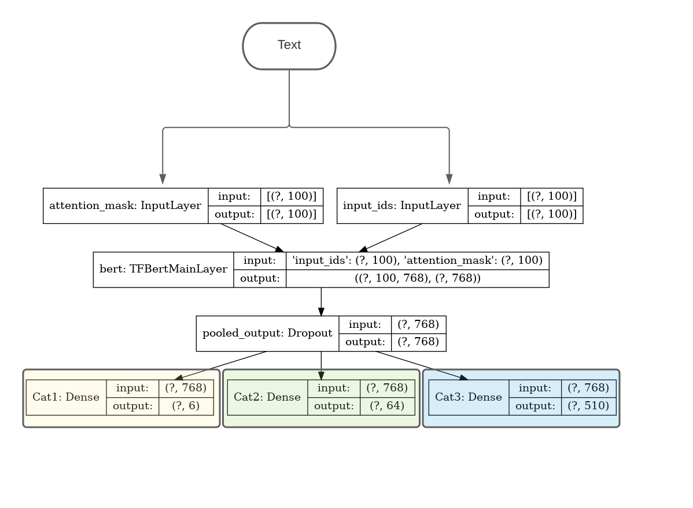
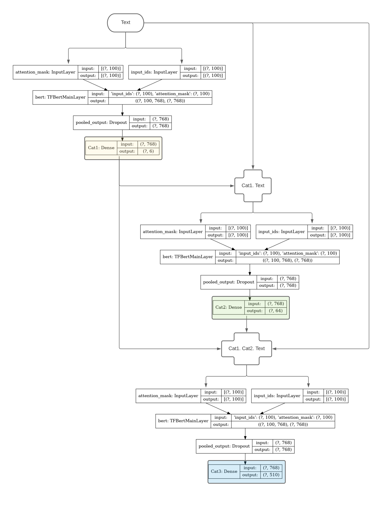
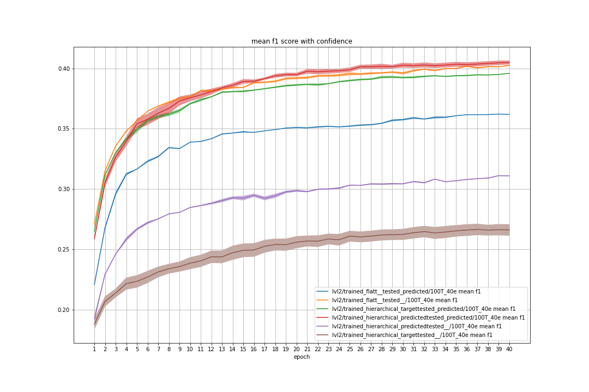
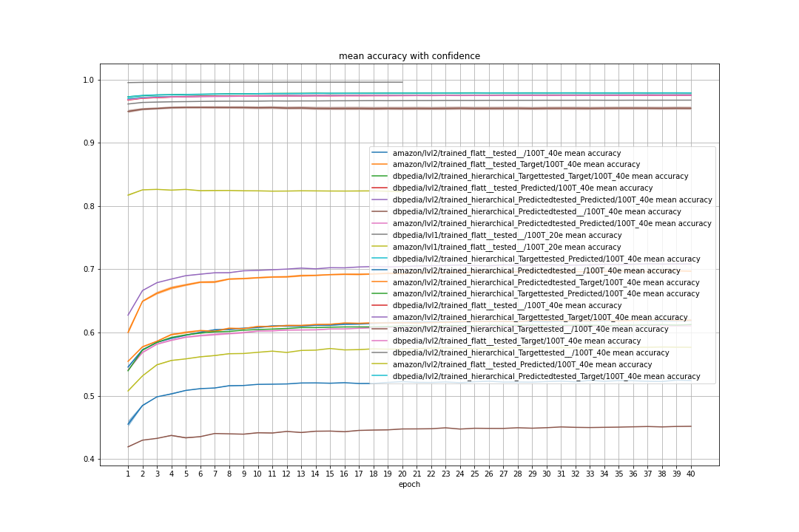
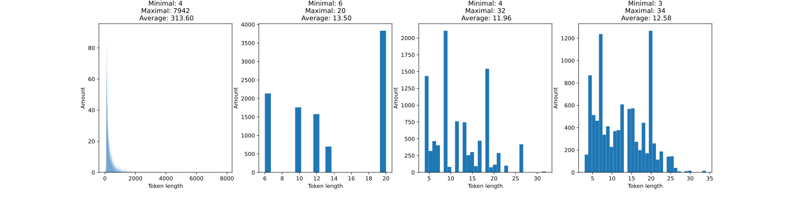
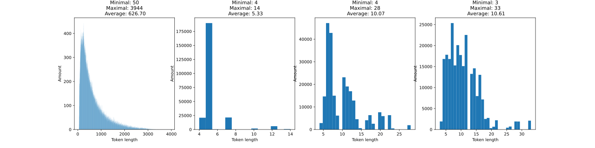

# BERT for hierarchicla text classification on a dataset with Amazon product reviews
Using the pretrained bert-base-uncased form [Hugging Face](https://huggingface.co/bert-base-uncased)   

Dataset with Amazon product reviews, classes are structured as:
* 6 "level 1" classes
* 64 "level 2" classes
* 510 "level 3" classes

The training set contains 40k documents and the test set 10k.  
Each document contains: Title, Text, Cat1, Cat2, Cat3  
## Model architectures

### All at once (Not used anymore)

### Hierarchical

## Latest Evaluation results on
### bert-base-uncased, 100 tokens and 20 epochs. Averaged over 4 runs.
Results are on the Test set

|Config                                 |Dataset |   Input             |   Output | Cat1 accuracy | Cat1 F1 score macro | Cat2 accuracy | Cat2 F1 score macro |Cat3 accuracy | Cat3 F1 score macro |
|:--------------------------------------|:-------|--------------------:|---------:|--------------:|--------------------:|--------------:|--------------------:|-------------:|--------------------:|
|config_lvl1_bert-base-uncased.yaml     |Amazon  |                Text |     Cat1 |        0.8178 |              0.8268 |             - |                   - |             -|                    -|
|config_lvl2_flat_bert-base-uncased.yaml|Amazon  |                Text |     Cat2 |        -      |              -      |             - |                   - |             -|                    -|
|config_lvl2_h_t_bert-base-uncased.yaml |Amazon  |          Cat1, Text |     Cat2 |        -      |              -      |             - |                   - |             -|                    -|
|config_lvl2_h_p_bert-base-uncased.yaml |Amazon  |Predicted Cat1, Text |     Cat2 |        -      |              -      |             - |                   - |             -|                    -|

## Results hyperparameter search:
Results are on the Test set
### Ordered after best f1 score and accuracy
|    | model              |   token |   epochs |     f1 |    acc |   time per epoch (m) |   f1 per second |
|---:|:-------------------|--------:|---------:|-------:|-------:|---------------------:|----------------:|
|  4 | bert-large-uncased |     200 |       10 | 0.8283 | 0.8364 |                20.35 |          0.0678 |
|  6 | bert-large-uncased |     100 |       10 | 0.8282 | 0.8364 |                10.83 |          0.1274 |
|  0 | bert-large-uncased |     100 |       20 | 0.828  | 0.8364 |                11.45 |          0.1205 |
|  3 | bert-large-uncased |     300 |       10 | 0.823  | 0.8325 |                38.9  |          0.0353 |
|  5 | bert-large-uncased |     300 |       05 | 0.823  | 0.8311 |                34.47 |          0.0398 |
|  1 | bert-large-uncased |     050 |       10 | 0.8178 | 0.828  |                 5.33 |          0.2556 |
| 10 | bert-base-uncased  |     100 |       20 | 0.8164 | 0.8257 |                 3.15 |          0.432  |
| 13 | bert-base-uncased  |     300 |       05 | 0.8148 | 0.8238 |                10.08 |          0.1347 |
| 12 | bert-base-uncased  |     100 |       05 | 0.8126 | 0.8223 |                 2.67 |          0.5079 |
|  9 | bert-base-cased    |     100 |       10 | 0.8103 | 0.8198 |                 2.95 |          0.4578 |
| 11 | bert-base-uncased  |     512 |       05 | 0.8089 | 0.8183 |                16.77 |          0.0804 |
|  2 | bert-large-uncased |     512 |       05 | 0.8088 | 0.82   |                61.82 |          0.0218 |
|  7 | bert-base-uncased  |     300 |       20 | 0.8087 | 0.818  |                 4.85 |          0.2779 |
|  8 | bert-base-uncased  |     512 |       20 | 0.8053 | 0.8155 |                 9.18 |          0.1462 |

### Ordered after best f1 per second ratio, i.e. $\frac{f1 \times 100}{\text{time per epoch} (s)}$
|    | model              |   token |   epochs |     f1 |    acc |   time per epoch (m) |   f1 per second |
|---:|:-------------------|--------:|---------:|-------:|-------:|---------------------:|----------------:|
| 12 | bert-base-uncased  |     100 |       05 | 0.8126 | 0.8223 |                 2.67 |          0.5079 |
|  9 | bert-base-cased    |     100 |       10 | 0.8103 | 0.8198 |                 2.95 |          0.4578 |
| 10 | bert-base-uncased  |     100 |       20 | 0.8164 | 0.8257 |                 3.15 |          0.432  |
|  7 | bert-base-uncased  |     300 |       20 | 0.8087 | 0.818  |                 4.85 |          0.2779 |
|  1 | bert-large-uncased |     050 |       10 | 0.8178 | 0.828  |                 5.33 |          0.2556 |
|  8 | bert-base-uncased  |     512 |       20 | 0.8053 | 0.8155 |                 9.18 |          0.1462 |
| 13 | bert-base-uncased  |     300 |       05 | 0.8148 | 0.8238 |                10.08 |          0.1347 |
|  6 | bert-large-uncased |     100 |       10 | 0.8282 | 0.8364 |                10.83 |          0.1274 |
|  0 | bert-large-uncased |     100 |       20 | 0.828  | 0.8364 |                11.45 |          0.1205 |
| 11 | bert-base-uncased  |     512 |       05 | 0.8089 | 0.8183 |                16.77 |          0.0804 |
|  4 | bert-large-uncased |     200 |       10 | 0.8283 | 0.8364 |                20.35 |          0.0678 |
|  5 | bert-large-uncased |     300 |       05 | 0.823  | 0.8311 |                34.47 |          0.0398 |
|  3 | bert-large-uncased |     300 |       10 | 0.823  | 0.8325 |                38.9  |          0.0353 |
|  2 | bert-large-uncased |     512 |       05 | 0.8088 | 0.82   |                61.82 |          0.0218 |  

### Graphs showing that only $5$ epochs are needed

## New Evaluations results
p(i,x) means predicted x by model i. Otherwise the Categorie labels are the target labels    
Input is allways a String, either only "Text" or if specified the categorie labels concatenated with ". " before the text.

|N° | Model                 | Input                           |Output            |Cat1 accuracy| Cat2 accuracy|F1 score macro|
|:--|:----------------------|:--------------------------------|:-----------------|:-------------|:-------------|:-------------|
|0  | Classifier_multi_2Cat | Text                            | Cat1, Cat2       |0.8223        | 0.5404       |-             |
|2  | Classifier_lvl1       | Text                            | Cat1             |0.8242        | -            | -            |
|2.1| Classifier_lvl1 300 T 10 ep     | Text                  | Cat1             |0.8241        | -            | -            |
|2.2| Classifier_lvl1 100 T 10 ep     | Text                  | Cat1             |0.8234        | -            |0.8234        |
|2.3| Classifier_lvl1 512 T 10 ep     | Text                  | Cat1             |0.8230        | -            |0.8123        |
|3  | Classifier_lvl2_f     | Text                            | Cat2             |-             | 0.5879       | -            |
|4  | Classifier_lvl2_h     | Cat1. Text                      | Cat2             |-             | 0.6670       | -            |
|5  | Classifier_lvl2_h     | p(2, Cat1). Text                | Cat2             |-             | 0.6315       | -            |

## Evaluations results
Training the models for 5 epochs using a maximal token length of 100 and a batch size of 26.   
p(i,x) means predicted x by model i. Otherwise the Categorie labels are the target labels    
Input is allways a String, either only "Text" or if specified the categorie labels concatenated with ". " before the text.

|N°  | Model                 | Input                           |Output            |Cat1 accuracy| Cat2 accuracy| Cat3 accuracy|F1 score macro
|:--|:----------------------|:--------------------------------|:-----------------|:-------------|:-------------|:-------------|:-------------
|0  | Classifier_multi_2Cat | Text                            | Cat1, Cat2       |0.8223        | 0.5404       | -            |-
|1  | Classifier_multi_3Cat | Text                            | Cat1, Cat2, Cat3 |0.8203        | 0.5192       | 0            |-
|1.2| Classifier_multi_3Cat 10 epochs | Text                  | Cat1, Cat2, Cat3 |0.824         | 0.5532       | 0.0026       |-
|2  | Classifier_lvl1       | Text                            | Cat1             |0.8242        | -            | -            |-
|2.1| Classifier_lvl1 300 T 10 ep     | Text                  | Cat1             |0.8241        | -            | -            |-
|2.2| Classifier_lvl1 100 T 10 ep     | Text                  | Cat1             |0.8234        | -            | -            |0.8234
|2.3| Classifier_lvl1 512 T 10 ep     | Text                  | Cat1             |0.8230        | -            | -            |0.8123
|3  | Classifier_lvl2_f     | Text                            | Cat2             |-             | 0.5879       | -            |-
|4  | Classifier_lvl2_h     | Cat1. Text                      | Cat2             |-             | 0.6670       | -            |-
|5  | Classifier_lvl2_h     | p(2, Cat1). Text                | Cat2             |-             | 0.6315       | -            |-
|6  | Classifier_lvl3_f     | Text                            | Cat3             |-             | -            | 0.0041       |-
|7  | Classifier_lvl3_h     | Cat1. Cat2. Text                | Cat3             |-             | -            | 0.0204       |-
|8  | Classifier_lvl3_h     | p(2, Cat1). Cat2. Text          | Cat3             |-             | -            | 0.0196       |-
|9  | Classifier_lvl3_h     | Cat1. p(2, Cat4). Text          | Cat3             |-             | -            | 0.0076       |-
|10 | Classifier_lvl3_h     | p(2, Cat1). p(2, Cat4). Text    | Cat3             |-             | -            | 0.0076       |-

## Data token length distribution
### Amazon

#### Training data

#### Test data

### DBPedia

#### Training data

#### Test data

## Labels statistics
### Amazon
#### Training data
Amount of appearances for Cat1:
 * unique values 6  
 * Minimal: grocery gourmet food appears 3617 times  
 * Maximal: toys games appears 10266 times  
 * in average 6666.67 times.  

Amount of appearances for Cat2:
 * unique values 64  
 * Minimal: small animals appears 29 times  
 * Maximal: personal care appears 2852 times  
 * in average 625.00 times.  

Amount of appearances for Cat3:
 * unique values 464  
 * Minimal: aprons smocks appears 1 times  
 * Maximal: unknown appears 2262 times  
 * in average 86.21 times.  

#### Test data
Amount of appearances for Cat1:
 * unique values 6  
 * Minimal: baby products appears 698 times  
 * Maximal: health personal care appears 2992 times  
 * in average 1666.67 times.  

Amount of appearances for Cat2:
 * unique values 64  
 * Minimal: baby food appears 2 times  
 * Maximal: nutrition wellness appears 904 times  
 * in average 156.25 times.  

Amount of appearances for Cat3:
 * unique values 377  
 * Minimal: aquarium hoods appears 1 times  
 * Maximal: vitamins supplements appears 665 times  
 * in average 26.53 times.  

### DBPedia

#### Training data
Amount of appearances for Cat1: 
 * unique values 9  
 * Minimal: Device appears 248 times  
 * Maximal: Agent appears 124798 times  
 * in average 26771.33 times.  
 
Amount of appearances for Cat2: 
 * unique values 70  
 * Minimal: Database appears 129 times  
 * Maximal: Athlete appears 31111 times  
 * in average 3442.03 times.  
 
Amount of appearances for Cat3: 
 * unique values 219  
 * Minimal: BiologicalDatabase appears 129 times  
 * Maximal: AcademicJournal appears 1924 times  
 * in average 1100.19 times. 

#### Test Data
Amount of appearances for Cat1: 
 * unique values 9  
 * Minimal: Device appears 62 times  
 * Maximal: Agent appears 31495 times  
 * in average 6754.89 times.  
 
Amount of appearances for Cat2: 
 * unique values 70  
 * Minimal: Database appears 33 times  
 * Maximal: Athlete appears 7855 times  
 * in average 868.49 times.  
 
Amount of appearances for Cat3: 
 * unique values 219  
 * Minimal: BiologicalDatabase appears 33 times  
 * Maximal: AcademicJournal appears 485 times  
 * in average 277.60 times.
---

[Based on](https://towardsdatascience.com/multi-label-multi-class-text-classification-with-bert-transformer-and-keras-c6355eccb63a)  
[Pretrained models](https://huggingface.co/transformers/pretrained_models.html)  
[BERT docu](https://huggingface.co/transformers/model_doc/bert.html)  
[Hierarchical text classification](https://www.kaggle.com/kashnitsky/hierarchical-text-classification)
[DBPedia](https://www.kaggle.com/danofer/dbpedia-classes?select=DBPEDIA_train.csv)
