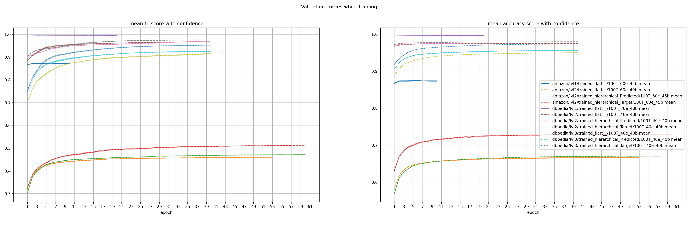
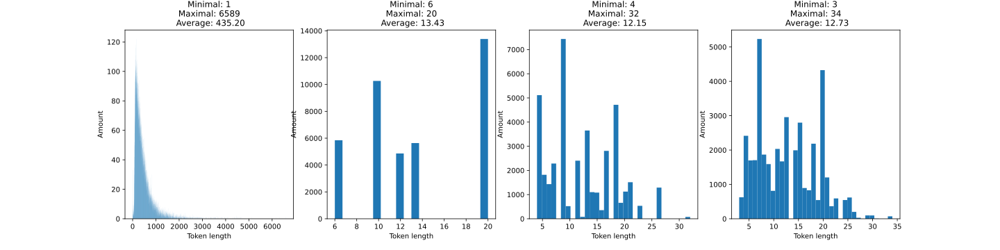
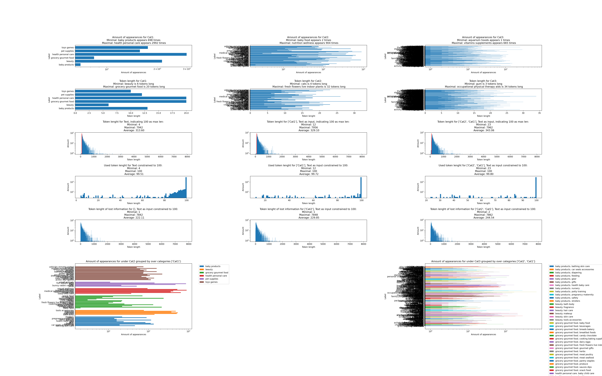
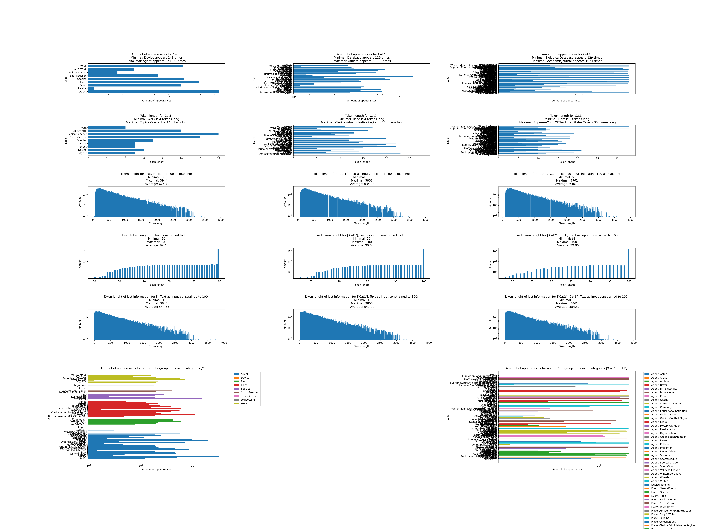

# BERT for hierarchicla text classification on Amazon product reviews and DBpedia
Multiple hierearchical text classification approaches using the pretrained bert-base-uncased model form [Hugging Face](https://huggingface.co/bert-base-uncased). On the [amazon reviews dataset](https://www.kaggle.com/kashnitsky/hierarchical-text-classification)  
and [DBpedia](https://www.kaggle.com/danofer/dbpedia-classes?select=DBPEDIA_train.csv) datasets.  

### Hierarchical Model architecture


## Requirements

This project was built with:

### Training and testing
- Python 3.8.5
- CUDA 11.2 (for GPU support)
- pyyaml 5.3.1 
- tensorflow 2.4.0
- numpy 1.19.2
- transformers 4.0.0 (Hugging Face pretrained models)
- pandas 1.1.3
- tensorflow_addons 0.12.0
- scikit-learn 0.23.2
- 
### Results visualization and comparison
- Jupyter lab 2.2.9 (For data analisys and results visualization)
- matplotlib 3.3.3 (Only needed for result comparison)
- tqdm=4.59.0

In the `requirements` folder are multiple files used to generate the requiered conda enviroments on different systems (training was done only on ubuntu 20.04)
Use `conda env create --name myname --file=requirements_(desired file).yml` to create the conda environment

## Data set preparation
### Amazon 
Amazon downloaded from [https://www.kaggle.com/kashnitsky/hierarchical-text-classification](https://www.kaggle.com/kashnitsky/hierarchical-text-classification)
Rename train_40k.csv to train.csv
Rename unlabeled_150k.csv to test.csv

The rest of the files are not needed.

### DBpedia
Downloade from [https://www.kaggle.com/danofer/dbpedia-classes](https://www.kaggle.com/danofer/dbpedia-classes)
Rename DBPEDIA_test.csv to test.csv
Rename DBPEDIA_train.csv to train.csv
The rest of the files are not needed.

## Configs
In the `Configs` folder are the diferent configurations for all trained models.
```yaml
model_name: bert-base-uncased #pre-trained model name (in all cases ber-base-uncased was used)
max_length: 100 #Maximal token length used as input
epochs: 60
batch_size: 45
repetitions: 3 #How many times should the model be trained 
data_path: amazon # on which dataset
lvl: 2 # Hierarchical lvl
# labels format: list of labels, i.e. [ label1, label2]
# label_i is for no labels (lvl1 or flat):
# label_i is for Target labels (direct from dataset): ['Target','Category name1', 'Category name2', 'Category name3']
# label_i is for predicted labels: ['Path to saved predictions1','Path to saved predictions2',...,'Path to saved predictions n']
# And combinations of both. The order will be label1. label2. Text where for label1 it adds all. e.g. label1: [lb1, lb2] then lb1. lb2. label2. Text.
labels: [['Target','Cat1']]  #Examplkes of target labels
# Same as labels but this are used for prediction, i.e. should not be target only predicted labels
test_labels: [['saved_models/bert-base-uncased/amazon/lvl1/trained_flatt__/100T_60e_45b/Run3/tested__/rep_and_histo.npz']]  #Examplkes of predicted labels
hierar: hierarchical #Denotes if it is a hierarchical or flat aproach
lable_type: Target # What kind of labels for training can be: _(flat) ,Target, Predicted or per_label
test_labels_type: Predicted # What kind of labels shoud be used for testing, can be: _(flat) ,Target, Predicted
```

## Usage
Run `Train.py` with the desired configurations from the `Configs` folder to train the desired models, e.g. `python Train.py ./Configs/amazon_config_lvl1_bert-base-uncased.yaml ./Configs/amazon_config_lvl2_per_label.yaml`

Run `Hyperparameter_search.py` to do a grid-search over the predifined hyperparameters. Hyperparameters can only be done over amazon and per_lvl, but neither on DBpedia nor on per_label. Give one or more options to search hyperparameters: Flat_lvl1, Flat_lvl2, tgt_pred, tgt_tgt, pred_pred. For runs containing pred (predictions) give the `rep_and_histo.npz` path that should be used for the input predictions.
For example `python Hyperparameter_search.py Flat_lvl2 tgt_tgt pred_pred saved_models/bert-base-uncased/amazon/lvl1/trained_flatt__/100T_60e_45b/Run3/tested__/rep_and_histo.npz`

For data analysis of the datasets see the `Data_analisis.ipynb` notebook and for a result generation and comparison see the `Result_table_generator.ipynb` notebook.

A selection of trained models can be downloaded from [Google Drvie])(https://drive.google.com/drive/folders/1G6O1dA5eqEJKgMOYelBAb0chpVXo7Pq_?usp=sharing)

Add the "saved_models" folder to the root of this project, i.e. here to be able to use it without changing paths.


## Results
### Only predicted results
In all cases as average of 3 runs for 100 Tokens


| Dataset   | Type      | Epochs   | Batch size| Train Input                  | Output   | Test Input                      | Cat1 accuracy   | Cat1 F1 score macro   | Cat2 accuracy   | Cat2 F1 score macro   | Cat3 accuracy   | Cat3 F1 score macro   |
|:----------|:----------|:---------|:----------|:-----------------------------|:---------|:--------------------------------|:----------------|:----------------------|:----------------|:----------------------|:----------------|:----------------------|
| amazon    | Per_lvl   | 60(10)   | 45        | Text                         | Cat1     | Text                            | 0.828(0.002)    | 0.819(0.002)          | -               | -                     | -               | -                     |
| amazon    | Per_lvl   | 60(53)   | 40        | Text                         | Cat2     | Text                            | -               | -                     | 0.622(0.003)    | 0.393(0.004)          | -               | -                     |
| amazon    | Per_lvl   | 60(60)   | 45        | Target Cat1, Text            | Cat2     | Predicted Cat1, Text            | -               | -                     | 0.612(0.000)    | 0.400(0.002)          | -               | -                     |
| amazon    | Per_lvl   | 60(60)   | 45        | Predicted Cat1, Text         | Cat2     | Predicted Cat1, Text            | -               | -                     | 0.624(0.002)    | 0.398(0.002)          | -               | -                     |
| amazon    | Per_label | 60       | 45        | Text divided per Target Cat1 | Cat2     | Text divided per Predicted Cat1 | -               | -                     | 0.624(0.000)    | 0.474(0.005)          | -               | -                     |
| ---       | --------- | ---      | ---       | ---                          | ---      | ---                             | ---             | ---                   | ---             | ---                   | ---             | ---                   |
| dbpedia   | Per_lvl   | 20(20)   | 40        | Text                         | Cat1     | Text                            | 0.996(0.000)    | 0.994(0.000)          | -               | -                     | -               | -                     |
| dbpedia   | Per_lvl   | 40(40)   | 40        | Text                         | Cat2     | Text                            | -               | -                     | 0.975(0.000)    | 0.968(0.001)          | -               | -                     |
| dbpedia   | Per_lvl   | 40(40)   | 40        | Target Cat1, Text            | Cat2     | Predicted Cat1, Text            | -               | -                     | 0.976(0.000)    | 0.970(0.001)          | -               | -                     |
| dbpedia   | Per_lvl   | 40(40)   | 40        | Predicted Cat1, Text         | Cat2     | Predicted Cat1, Text            | -               | -                     | 0.976(0.000)    | 0.969(0.001)          | -               | -                     |
| dbpedia   | Per_label | 60       | 45        | Text divided per Target Cat1 | Cat2     | Text divided per Predicted Cat1 | -               | -                     | 0.977(0.000)    | 0.972(0.001)          | -               | -                     |
| dbpedia   | Per_lvl   | 40(40)   | 40        | Text                         | Cat3     | Text                            | -               | -                     | -               | -                     | 0.951(0.001)    | 0.918(0.007)          |
| dbpedia   | Per_lvl   | 40(40)   | 40        | Target Cat1, Cat2, Text      | Cat3     | Predicted Cat1, Cat2, Text      | -               | -                     | -               | -                     | 0.954(0.001)    | 0.931(0.003)          |
| dbpedia   | Per_lvl   | 40(40)   | 40        | Predicted Cat1, Cat2, Text   | Cat3     | Predicted Cat1, Cat2, Text      | -               | -                     | -               | -                     | 0.953(0.001)    | 0.922(0.005)          |
| dbpedia   | Per_label | 60       | 45        | Text divided per Target Cat2 | Cat3     | Text divided per Predicted Cat2 | -               | -                     | -               | -                     | 0.962(0.000)    | 0.957(0.000)          |


### predicted results with training and testing on target for comparisson
In all cases as average of 3 runs for 100 Tokens


| Type      | Dataset   | Epochs   | Tokens   | Batch size   | Runs   | Train Input                  | Output   | Test Input                      | Cat1 accuracy   | Cat1 F1 score macro   | Cat2 accuracy   | Cat2 F1 score macro   | Cat3 accuracy   | Cat3 F1 score macro   |
|:----------|:----------|:---------|:---------|:-------------|:-------|:-----------------------------|:---------|:--------------------------------|:----------------|:----------------------|:----------------|:----------------------|:----------------|:----------------------|
| Per_lvl   | amazon    | 60(10)   | 100      | 45           | 3      | Text                         | Cat1     | Text                            | 0.828(0.002)    | 0.819(0.002)          | -               | -                     | -               | -                     |
| ---       | ---       | ---      | ---      | ---          | ---    | ---                          | ---      | ---                             | ---             | ---                   | ---             | ---                   | ---             | ---                   |
| Per_lvl   | amazon    | 60(53)   | 100      | 40           | 3      | Text                         | Cat2     | Text                            | -               | -                     | 0.622(0.003)    | 0.393(0.004)          | -               | -                     |
| Per_lvl   | amazon    | 60(60)   | 100      | 45           | 3      | Target Cat1, Text            | Cat2     | Target Cat1, Text               | -               | -                     | 0.706(0.001)    | 0.464(0.004)          | -               | -                     |
| Per_lvl   | amazon    | 60(60)   | 100      | 45           | 3      | Target Cat1, Text            | Cat2     | Predicted Cat1, Text            | -               | -                     | 0.612(0.000)    | 0.400(0.002)          | -               | -                     |
| Per_lvl   | amazon    | 60(60)   | 100      | 45           | 3      | Predicted Cat1, Text         | Cat2     | Predicted Cat1, Text            | -               | -                     | 0.624(0.002)    | 0.398(0.002)          | -               | -                     |
| Per_label | amazon    | 60       | 100      | 45           | 3      | Text divided per Target Cat1 | Cat2     | Text divided per Target Cat1    | -               | -                     | 0.722(0.001)    | 0.567(0.004)          | -               | -                     |
| Per_label | amazon    | 60       | 100      | 45           | 3      | Text divided per Target Cat1 | Cat2     | Text divided per Predicted Cat1 | -               | -                     | 0.624(0.000)    | 0.474(0.005)          | -               | -                     |
| ===       | ===       | ===      | ===      | ===          | ===    | ===                          | ===      | ===                             | ===             | ===                   | ---             | ---                   | ---             | ---                   |
| Per_lvl   | dbpedia   | 20(20)   | 100      | 40           | 3      | Text                         | Cat1     | Text                            | 0.996(0.000)    | 0.994(0.000)          | -               | -                     | -               | -                     |
| ---       | ---       | ---      | ---      | ---          | ---    | ---                          | ---      | ---                             | ---             | ---                   | ---             | ---                   | ---             | ---                   |
| Per_lvl   | dbpedia   | 40(40)   | 100      | 40           | 3      | Text                         | Cat2     | Text                            | -               | -                     | 0.975(0.000)    | 0.968(0.001)          | -               | -                     |
| Per_lvl   | dbpedia   | 40(40)   | 100      | 40           | 3      | Target Cat1, Text            | Cat2     | Target Cat1, Text               | -               | -                     | 0.979(0.000)    | 0.975(0.001)          | -               | -                     |
| Per_lvl   | dbpedia   | 40(40)   | 100      | 40           | 3      | Target Cat1, Text            | Cat2     | Predicted Cat1, Text            | -               | -                     | 0.976(0.000)    | 0.970(0.001)          | -               | -                     |
| Per_lvl   | dbpedia   | 40(40)   | 100      | 40           | 3      | Predicted Cat1, Text         | Cat2     | Predicted Cat1, Text            | -               | -                     | 0.976(0.000)    | 0.969(0.001)          | -               | -                     |
| Per_label | dbpedia   | 60       | 100      | 45           | 3      | Text divided per Target Cat1 | Cat2     | Text divided per Target Cat1    | -               | -                     | 0.980(0.000)    | 0.977(0.001)          | -               | -                     |
| Per_label | dbpedia   | 60       | 100      | 45           | 3      | Text divided per Target Cat1 | Cat2     | Text divided per Predicted Cat1 | -               | -                     | 0.977(0.000)    | 0.972(0.001)          | -               | -                     |
| ---       | ---       | ---      | ---      | ---          | ---    | ---                          | ---      | ---                             | ---             | ---                   | ---             | ---                   | ---             | ---                   |
| Per_lvl   | dbpedia   | 40(40)   | 100      | 40           | 3      | Text                         | Cat3     | Text                            | -               | -                     | -               | -                     | 0.951(0.001)    | 0.918(0.007)          |
| Per_lvl   | dbpedia   | 40(40)   | 100      | 40           | 3      | Target Cat1, Cat2, Text      | Cat3     | Target Cat1, Cat2, Text         | -               | -                     | -               | -                     | 0.975(0.001)    | 0.954(0.003)          |
| Per_lvl   | dbpedia   | 40(40)   | 100      | 40           | 3      | Target Cat1, Cat2, Text      | Cat3     | Predicted Cat1, Cat2, Text      | -               | -                     | -               | -                     | 0.954(0.001)    | 0.931(0.003)          |
| Per_lvl   | dbpedia   | 40(40)   | 100      | 40           | 3      | Predicted Cat1, Cat2, Text   | Cat3     | Predicted Cat1, Cat2, Text      | -               | -                     | -               | -                     | 0.953(0.001)    | 0.922(0.005)          |
| Per_label | dbpedia   | 60       | 100      | 45           | 3      | Text divided per Target Cat2 | Cat3     | Text divided per Target Cat2    | -               | -                     | -               | -                     | 0.983(0.000)    | 0.982(0.000)          |
| Per_label | dbpedia   | 60       | 100      | 45           | 3      | Text divided per Target Cat2 | Cat3     | Text divided per Predicted Cat2 | -               | -                     | -               | -                     | 0.962(0.000)    | 0.957(0.000)          |

# Training validation curves for flat and per-level
No curves for per-label since there are a lot of classifiers with different categories, it would be a mess.

Mean accuracy and f1 macro score with 95% confidence interval

# Hyperparameter search
MAX_LENGTH = [64, 100, 256, 512]  
BATCH_SIZE = [10, 20, 40, 45, 50, 60]
# Level 1 flat


# Level 2 flat


# Level 2 hierarchical with predicted labels


# Level 2 hierarchical with target labels


## Data Analysis, token length distribution
### Amazon

#### Training data


#### Test data



### DBPedia

#### Training data


#### Test data


## Labels statistics
### Amazon
#### Training data
Amount of appearances for Cat1:
 * unique values 6  
 * Minimal: grocery gourmet food appears 3617 times  
 * Maximal: toys games appears 10266 times  
 * in average 6666.67 times.  


Amount of appearances for Cat2:
 * unique values 64  
 * Minimal: small animals appears 29 times  
 * Maximal: personal care appears 2852 times  
 * in average 625.00 times.  


Amount of appearances for Cat3:
 * unique values 464  
 * Minimal: aprons smocks appears 1 times  
 * Maximal: unknown appears 2262 times  
 * in average 86.21 times.  


#### Test data
Amount of appearances for Cat1:
 * unique values 6  
 * Minimal: baby products appears 698 times  
 * Maximal: health personal care appears 2992 times  
 * in average 1666.67 times.  


Amount of appearances for Cat2:
 * unique values 64  
 * Minimal: baby food appears 2 times  
 * Maximal: nutrition wellness appears 904 times  
 * in average 156.25 times.  


Amount of appearances for Cat3:
 * unique values 377  
 * Minimal: aquarium hoods appears 1 times  
 * Maximal: vitamins supplements appears 665 times  
 * in average 26.53 times.  

### DBPedia

#### Training data
Amount of appearances for Cat1: 
 * unique values 9  
 * Minimal: Device appears 248 times  
 * Maximal: Agent appears 124798 times  
 * in average 26771.33 times.  
 
Amount of appearances for Cat2: 
 * unique values 70  
 * Minimal: Database appears 129 times  
 * Maximal: Athlete appears 31111 times  
 * in average 3442.03 times.  
 
Amount of appearances for Cat3: 
 * unique values 219  
 * Minimal: BiologicalDatabase appears 129 times  
 * Maximal: AcademicJournal appears 1924 times  
 * in average 1100.19 times. 

#### Test Data
Amount of appearances for Cat1: 
 * unique values 9  
 * Minimal: Device appears 62 times  
 * Maximal: Agent appears 31495 times  
 * in average 6754.89 times.  
 
Amount of appearances for Cat2: 
 * unique values 70  
 * Minimal: Database appears 33 times  
 * Maximal: Athlete appears 7855 times  
 * in average 868.49 times.  
 
Amount of appearances for Cat3: 
 * unique values 219  
 * Minimal: BiologicalDatabase appears 33 times  
 * Maximal: AcademicJournal appears 485 times  
 * in average 277.60 times.
---
#Sources 
[Based on](https://towardsdatascience.com/multi-label-multi-class-text-classification-with-bert-transformer-and-keras-c6355eccb63a)  
[Pretrained models](https://huggingface.co/transformers/pretrained_models.html)  
[BERT docu](https://huggingface.co/transformers/model_doc/bert.html)  
[Hierarchical text classification](https://www.kaggle.com/kashnitsky/hierarchical-text-classification)  
[DBPedia](https://www.kaggle.com/danofer/dbpedia-classes?select=DBPEDIA_train.csv)
